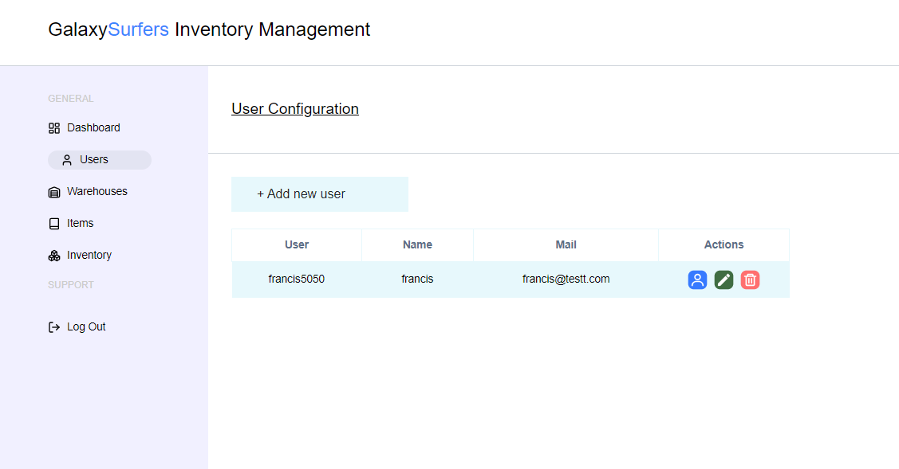

# Galaxy Surfers - 3D Inventory Management System

GalaxySurfers is an advanced inventory management system that lets you design and visualize your warehouse in a 3D model. Easily track products entering and exiting the warehouse, ensuring efficient inventory control and management.

During this project, I successfully implemented REST APIs, integrated 3D models using Three.js, and developed a backend with Node.js and Express. I connected the application to a PostgreSQL database, following the MVC architecture with controllers, routes, and models. I also set up database migrations to transition data to the production environment and created seed files to populate tables with initial data. For user notifications, I utilized React-Toastify to handle alerts upon completing actions.

Techologies used: React, Typescript, TailwindCSS, Node.js, Express, Postgresql.

# Login Information
This project doesn't contain a sign-up because the idea of the project is that the employee will be provided with the login information to access the application.

username: admin

password: 12345678

# Application live link
https://galaxysurfers-ims-client.vercel.app

